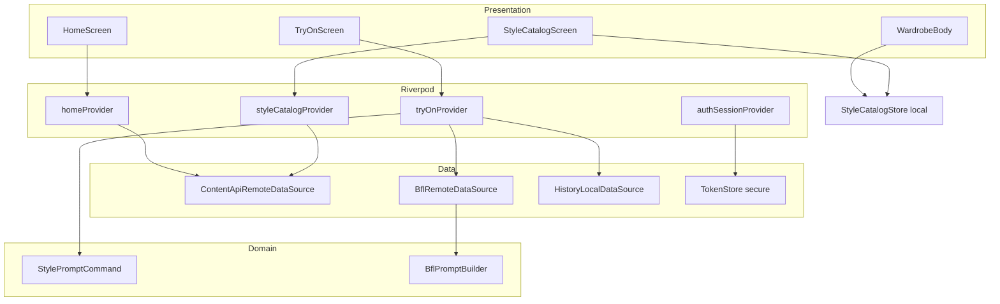

# Pre-Backend Integration — Full App Audit

**Audit date:** 2026-10-02  
**Scope:** Read-only review of the Flutter app as shipped in this repository. No code was modified for this document.  
**API default base:** `https://appworkspro.com/api/v1` (`lib/core/config/api_config.dart`)

---

## 1. Executive Summary

The app is a **feature-first Flutter client** (Riverpod + GoRouter + Dio) with a **single Try-On generation engine** (direct **BFL/FLUX** via `BflRemoteDataSource`, not the backend `tryOnApiRepository` path). Catalog content is **419 styles**, fully defined locally in `StyleCatalogStore` + bundled PNGs under `assets/images/home/…`, with **optional API overlays** for Home feed thumbnails and Style Catalog grids.

**Backend integration is partially wired:**

| Area | Today | Gap |
|------|--------|-----|
| Auth / profile | Backend API + secure tokens | Firebase packages present; primary auth is API |
| Home feed | `GET /home/feed?gender=` | Feed error blocks Home; rails still render with local fallback while loading |
| Catalog grids | `GET /catalog/{categoryId}?gender=&tab=` | Merged into UI; **BFL reference image still uses bundled `assetPath` only** |
| Wardrobe browse tab | **Local only** (`WardrobeBody`) | API merge widget exists but is **not mounted** |
| History | **Local SharedPreferences** | `HistoryRemoteDataSource.fetchHistory()` returns `[]`; History API providers exist but **History UI uses local list only** |
| Generation | BFL client | `TryOnApiRepository` **not** used by `tryOnProvider` |
| Prompts | App builds `StylePromptCommand` in Dart | Optimized CSV (`BACKEND_PROMPT_CATALOG_OPTIMIZED.csv`) differs from app on **79/419** action suffixes (metadata identical) |

**Top risks before backend go-live:** (1) API thumbnails without hosted reference images → generation may omit `input_image_2`; (2) Home/Wardrobe **display assets ≠ BFL reference paths** on several rails; (3) 77 orphaned PNGs on disk; (4) dual prompt catalogs (app vs optimized) if backend stores optimized strings while app still emits long form.

**Authoritative per-style asset + ID matrix:** `docs/BACKEND_ASSET_CATALOG.csv` (419 rows, all local paths verified on disk).

---

## 2. App Architecture



**Routes (shell + root):**

| Path | Screen | Notes |
|------|--------|--------|
| `/splash` | Splash | Manual Continue |
| `/onboarding` | Onboarding | |
| `/language` | Languages | `?first=1` after onboarding |
| `/login`, `/sign-up`, … | Auth | Guest supported |
| `/home`, `/wardrobe`, `/history`, `/settings` | Shell tabs | |
| `/styles/:categoryId` | Style catalog | Query: `tab`, `section` |
| `/try-on` | Try-On | `extra`: `TryOnRouteArgs` |

---

## 3. Asset Audit

### 3.1 Inventory totals (filesystem)

| Metric | Count | Source |
|--------|------:|--------|
| Image files under `assets/images/` | **669** | Filesystem scan |
| `style_*.png` under `assets/images/home/` | **496** | Filesystem |
| Catalog styles (canonical) | **419** | `BACKEND_ASSET_CATALOG.csv` |
| Catalog local paths missing on disk | **0** | Verified against CSV |
| `style_*.png` **not** in asset catalog | **77** | All under `assets/images/home/wardrobe/regional/` (legacy folder; app uses `men/wardrobe/…` and `women/wardrobe/…`) |
| Duplicate `style_id` in catalog | **0** | CSV |

Non-catalog image groups: `home/ui/` (section cards, Beauty Lab icons, outfit/occasion/couple/preset previews), `wardrobe/ui/` (regional rail previews), `wardrobe/wardrobe_saved_look_*.png` (My Wardrobe placeholders), splash/onboarding/languages flags, icons (separate tree).

### 3.2 Catalog styles by category (419)

| category_id | Styles | tab_id values | gender | Primary UI | Home | Wardrobe | Try-On | Load source |
|-------------|-------:|---------------|--------|------------|:----:|:--------:|:------:|-------------|
| `beard_styles` | 10 | — | men | Beauty Lab → Catalog | ✓ | — | ✓ | Local PNG; API thumb optional |
| `hair_styles` | 16 | men, women | men, women | Beauty Lab → Catalog | ✓ | — | ✓ | Local PNG; API thumb optional |
| `hair_color` | 20 | men, women | men, women | Beauty Lab → Catalog | ✓ | — | ✓ | Local PNG; API thumb optional |
| `hijab_styles` | 10 | — | women | Beauty Lab → Catalog | ✓ | — | ✓ | Local PNG; API thumb optional |
| `virtual_try_on` | 20 | — | men, women | Beauty Lab → Catalog | ✓ | — | ✓ | Local PNG; API thumb optional |
| `outfit_change` | 13 | — | men, women | Home rail | ✓ | — | ✓ | Local PNG; API thumb optional |
| `occasions` | 50 | casual, formal, wedding | men, women | Home rail | ✓ | — | ✓ | Local PNG; API thumb optional |
| `couple_duo` | 11 | — | neutral | Home rail | ✓ | — | ✓ | Local PNG; API thumb optional |
| `presets` | 10 | preset_gym | men | Home rail | ✓ | — | ✓ | Local PNG; API thumb optional |
| `wardrobe_browse` | 259 | arabian, bottoms, chinese, indian, jackets, korean, pakistani, shirts, skirts, tops | men, women | Wardrobe rails + Catalog | — | ✓ | ✓ | Local PNG; API thumb optional |

**Per-style fields (all 419):** see `docs/BACKEND_ASSET_CATALOG.csv` columns: `style_id`, `category_id`, `title_key`, `gender`, `tab_id`, `sort_order`, `local_asset_path`, `suggested_image_url_path`.

**Display vs reference (important):**

- **Home Outfit Change rail** uses `AppAssets.homeOutfitChange1/2/3` for **display** but passes real **`style_id`** from `StyleCatalogStore` on tap (`home_feed_sections.dart`).
- **Home Occasions / Couple / Presets** use **UI preview PNGs** in rails; tap uses catalog **`style_id`** (same pattern).
- **Wardrobe regional rails** use `AppAssets.wardrobeUiRailSet(tab)` (3 files in `assets/images/wardrobe/ui/`) for **display**, but **`styleId`** comes from `StyleCatalogStore` wardrobe items (`wardrobe_catalog.dart`). **BFL reference** resolves via `StyleCatalogStore.findItem(…).assetPath` → full catalog PNG under `home/{gender}/wardrobe/…`, not the rail UI PNG.

### 3.3 Beauty Lab / regional / garment asset roots (code)

Defined in `lib/core/constants/assets.dart` via `_styleCatalog(...)` → paths like:

- `assets/images/home/men/beauty-lab/beard-styles/style_XX.png`
- `assets/images/home/women/occasions/wedding/style_XX.png`
- `assets/images/home/men/wardrobe/regional/chinese/style_XX.png`
- `assets/images/home/women/wardrobe/garments/tops/style_XX.png`

Wardrobe browse counts in code match catalog totals (259): regional + garment lists sum to catalog row count.

### 3.4 UI-only assets (not in 419 catalog)

| Asset group | Path pattern | Used by |
|-------------|--------------|---------|
| AI Studio banner | `home/ui/home_studio_card_*.png`, model | `HomeStudioBanner` |
| Beauty Lab category icons | `home/ui/beauty_*.png` | `HomeBeautyLabSection` (overridable by API thumb) |
| Section rail previews | `home/ui/outfit_change_*.png`, `occasion_*.png`, `couple_*.png`, `preset_*.png` | Home rails (display only) |
| Wardrobe rail previews | `wardrobe/ui/{region}_rail_01..03.png` | Wardrobe category sections |
| My Wardrobe samples | `wardrobe/wardrobe_saved_look_*.png` | Placeholder until wardrobe looks API |
| Onboarding / splash / flags | respective folders | Onboarding, splash, language picker |

### 3.5 Unused / legacy / duplicate findings

| Issue | Severity | Detail |
|-------|----------|--------|
| **77 orphan PNGs** | MEDIUM | `assets/images/home/wardrobe/regional/**/style_*.png` — not referenced by `AppAssets` or catalog CSV |
| **`outfit_change_catalog_assets.dart`** | LOW | File exists with paths under `home/bottoms/...`; **not imported** by any Dart file (dead) |
| **Shared rail UI assets** | INFO | Same 3 `wardrobe/ui/*_rail_*.png` reused per region; distinct `style_id` per tile — intentional preview pattern |
| **Duplicate style_id** | None | — |
| **Styles without assets** | **0** | All 419 CSV paths exist |
| **Styles without prompts** | **0** | All 419 in `BACKEND_PROMPT_CATALOG*.csv` |

---

## 4. 419 Style Mapping Audit

| Check | Result |
|-------|--------|
| Total catalog styles | **419** |
| Unique `style_id` | **419** |
| Asset path on disk | **419/419** |
| `prompt_command` (app catalog CSV) | **419/419** |
| `prompt_command` (optimized CSV) | **419/419** |
| Python `style_prompt_command()` vs `BACKEND_PROMPT_CATALOG.csv` | **0 mismatches** (matches `style_prompt_command.dart` rules) |
| Optimized vs app `prompt_command` | **79 differ** (action suffix only; `style_ref`, `category`, `pipeline`, `tab`, `region` unchanged) |

**Chain per style (intended):**

```text
local_asset_path (PNG)
  → style_id (StyleCatalogStore / CSV)
  → StylePromptCommand.forSelection(categoryId, styleId, item)
  → BflPromptBuilder.build(categoryId, styleCommand, hasReferenceStyle)
  → BflRemoteDataSource (input_image_1 = user, input_image_2 = style file if resolved)
```

**BFL template mapping (419):**

| BflPromptBuilder | Styles |
|------------------|-------:|
| `_beardStyles` | 10 |
| `_hairStyles` | 16 |
| `_hairColor` | 20 |
| `_hijabStyles` | 10 |
| `_outfit` | 363 |

**AI Studio:** Not one of the 419; no `style_id` in catalog CSV.

---

## 5. Home Feed Audit

### 5.1 Sections rendered (always, local layout)

Order in `home_screen.dart`:

1. `HomeStudioBanner` → **AI Studio** (`TryOnRouteArgs.studio()`)
2. `HomeBeautyLabSection` → five categories → **Style Catalog** routes only
3. `HomeOutfitChangeSection`
4. `HomeOccasionsSection`
5. `HomeCoupleStylesSection`
6. `HomeAiLookPresetsSection`

### 5.2 Data source

- `homeProvider` → `GetHomeFeed` → `HomeRemoteDataSource` → **`GET /home/feed?gender=`** (`ContentApiRemoteDataSource.fetchHomeFeed`).
- Model fields used: `HomeFeedSectionModel` (`id`, `category_id`, `title`, `items[]`), `HomeFeedItemModel` (`style_id`, `category_id`, `thumbnail_url`, `name`, `id`).
- Thumbnails resolved with `ApiMediaUrl.resolve` (site origin `/media/...`).

### 5.3 API vs local behavior

- **`apiRailItemsFor`:** API section must exist, items have non-empty `style_id`, and **at least one thumbnail**; else **100% local fallback** rails from `StyleCatalogStore` + UI assets.
- **`_mergeRailItems`:** API index-aligned merge; fills `imageUrl` from API, `asset` from fallback or `StyleCatalogStore.findItem`, `styleId` from API.
- **Loading:** `feed.loading` still shows full `homeScroll()` (same as success) — not a blank home.
- **Error:** Full-screen `AppErrorState` with retry (no partial home).

### 5.4 Tap → Try-On flow

```text
Home rail tile
  → context.push(/try-on, TryOnRouteArgs.catalog(categoryId, styleId))
  → tryOnProvider.configure(args)
  → User photo (+ crop for outfit categories)
  → generate()
  → stylePath = user dress upload OR StyleCatalogStore.findItem(categoryId, styleId).assetPath
  → StylePromptCommand.forSelection(...)
  → BflPromptBuilder + BflRemoteDataSource
```

**Beauty Lab card:** `push(/styles/{categoryId})` — user picks style in grid first.

**Reference image:** Bundled catalog PNG copied to temp unless user uploaded style/dress photo. **Remote catalog `imageUrl` is not downloaded for BFL** (`try_on_provider` / `bfl_remote_datasource`).

---

## 6. Wardrobe Audit

### 6.1 Browse tab (current production path)

- `WardrobeBody` → `WardrobeCatalog.sections` (5 regional sections: chinese, indian, korean, pakistani, arabian).
- `WardrobeCategorySection`: gender chips → `railItemsFor(browseTabId, gender)` → **3 tiles** with UI rail PNG + catalog **`style_id`**.
- **View All:** `/styles/wardrobe_browse?tab={browseTabId}&section={titleKey}`.
- **Tile tap:** `TryOnRouteArgs.catalog(wardrobe_browse, styleId)` → crop step → generate with `mode=wardrobe_browse`.

### 6.2 Garment tabs (shirts, tops, …)

Available in **`StyleCatalogScreen`** for `wardrobe_browse` (full grid from `StyleCatalogStore`), not as separate Wardrobe home sections.

### 6.3 API path (not on browse UI)

- `WardrobeApiCategorySection` + `mergeWardrobeRailItems` + `GET /catalog/wardrobe_browse` — **not used** in `WardrobeBody` (comment: local until backend images ready).
- `wardrobeCategoriesProvider` → **`GET /wardrobe/categories`** — used for other features / invalidation, not browse rails.

### 6.4 Local vs future API

| Data | Today | Target |
|------|--------|--------|
| Rail/grid thumbnails | Local UI + catalog PNG | `thumbnail_url` / `image_url` from API |
| BFL reference | Local `assetPath` only | **`reference_image` URL** must be fetched or server-side generation |
| Section list | Static `WardrobeCatalog` | Optional `/wardrobe/categories` |

---

## 7. Try-On Audit

| Step | Implementation |
|------|----------------|
| Entry | `/try-on` + `TryOnRouteArgs` |
| State | `tryOnProvider` (`TryOnStatus`: idle → photoSelected/editing → uploading → processing → success/failure) |
| Pick photo | `image_picker` + `ImageCompressor` |
| Crop | Outfit / wardrobe / most catalog (not beauty prompt-edit / virtual try-on path rules in notifier) |
| Generate | `TryOnRepositoryImpl` → **`BflRemoteDataSource`** only |
| Prompt | `BflPromptBuilder.build` + optional `StylePromptCommand` prefix |
| Save | `_persistHistoryItem` → **`HistoryLocalDataSource`** (SharedPreferences) |
| Share / gallery | `share_plus`, `gal` |
| Favorite toggle | Updates local history item |

**Not wired:** `tryOnApiRepositoryProvider` (backend job/poll models exist in `try_on_api_models.dart`).

---

## 8. AI Studio Audit (separate from 419)

| Aspect | Behavior |
|--------|----------|
| Entry | `TryOnRouteArgs.studio()`; default if `/try-on` missing `extra` |
| `categoryId` / BFL `mode` | `'studio'` |
| User photo | Required (`input_image_1`) |
| User text | **Required** — `TryOnState.canGenerate` / `tryOnNeedPrompt` |
| Reference image | **None** — `hasReferenceStyle` false; `_studio()` in `bfl_prompt_builder.dart` |
| `StylePromptCommand` | No `style_id`; studio branch in builder |
| Catalog | **Excluded** from 419 CSV and `StyleCatalogStore` counts |

---

## 9. First-Time User Flow (from code)

1. **Launch** → `main.dart`: Firebase bootstrap, `.env`, `ProviderScope`, `AiWardrobeApp`.
2. **Router** → `/splash` (`app_router.dart` `initialLocation`).
3. **Splash** → `prepareLaunch()` waits language + onboarding providers (timeouts); user taps **Continue** → `continueFromSplash`.
4. **Onboarding** (if `onboarding_completed` false) → complete/skip → `LaunchDestination`.
5. **Language** (if `language_selected` false) → `/language?first=1` → save → **`/login`**.
6. **Auth** → login / sign-up / **guest** (`continueAsGuest`, no network required) → `context.go(/home)`.
7. **Home** → static sections; feed fetch in parallel (may error independently).
8. **Pick feature** → catalog or direct try-on (see §5–6).
9. **Try-On** → pick photo → (crop if applicable) → generate via BFL.
10. **Result** → save to **local history**, share, favorite (local), try another.

**Permissions:** No camera/gallery permission wrapper in Try-On beyond `image_picker` defaults. **Notifications** permission via `NotificationPermissionService` when enabling notifications in Settings. FCM configured in `firebase_messaging_service.dart`.

---

## 10. Returning User Flow

| Scenario | Behavior |
|----------|----------|
| Reopen app | `/splash` again → Continue → home if onboarding/language/auth satisfied |
| Session restore | `AuthSession.build` → `restoreSession()` + tokens in **FlutterSecureStorage**; `GET /users/me` when online |
| Remember me off | Ephemeral flag → cold start may **sign out** in `auth_repository_impl.currentUser()` |
| Guest return | Local guest profile in SharedPreferences; **no tokens** |
| Logout | Clears tokens, local auth, history local + image cache cleanup (`user_session_cleanup.dart`) |
| Login again | Standard auth → home |
| No / slow internet | `ConnectivityBannerOverlay` (hidden on splash/onboarding); auth actions may fail with `NetworkFailure`; home feed error UI; catalog API merge **falls back to local** in `styleCatalogProvider` |
| API 401 | Token refresh; failure → session expired → navigate login + snack (`app.dart`) |
| Empty history | `HistoryGrid` empty state |
| Existing history | `historyListProvider` → local JSON in SharedPreferences; remote merge always empty today |

---

## 11. App Kill / Restart Behavior

| State | Persisted? | Storage |
|-------|------------|---------|
| Onboarding complete | Yes | SharedPreferences `onboarding_completed` |
| Language choice | Yes | `app_language`, `language_selected` |
| Auth profile | Yes (non-guest, remember me) | SharedPreferences auth keys |
| API tokens | Yes | FlutterSecureStorage |
| Theme / notifications pref / style gender | Yes | Settings SharedPreferences |
| Try-On in progress | **No** | Lost on kill |
| Selected catalog tab/gender | **No** (Riverpod; rebuilt) | — |
| History / favorites | Yes | SharedPreferences `history_items` + local file paths |
| Cached network images | Yes (disk cache) | `cached_network_image` |
| Generated result not saved | **No** | Temp paths |

**Cold start:** Always splash route; providers re-fetch feed/catalog as screens mount.

---

## 12. Data Persistence

| Data | Location |
|------|----------|
| History items | SharedPreferences + app documents (image files via `RemoteImageLoader.persistInAppStorage`) |
| Auth tokens | Secure storage |
| Auth profile / guest | SharedPreferences |
| Onboarding / language / settings | SharedPreferences |
| Catalog / prompts | **APK assets + Dart** (`StyleCatalogStore`, not DB) |
| Home feed | **Transient** (Riverpod `homeProvider`) |
| API catalog merge | **Transient** (`styleCatalogProvider`) |

---

## 13. Current Local Data

- **419** catalog PNGs + UI/rail/onboarding assets in repo.
- **419** prompt definitions (generated rules matching Dart).
- **StyleCatalogStore** mirrors asset lists and ids.
- **History** entirely on-device until remote datasource is implemented.
- **Guest** identity local only.

---

## 14. Backend Migration Requirements

| Class | Examples | Recommended home |
|-------|----------|------------------|
| **A. Static catalog metadata** | category_id, tab_id, gender, sort, title_key | **API** (+ local fallback until stable) |
| **B. Asset / reference images** | `/media/catalog/{category}/{style_id}.webp` | **CDN/STORAGE**; app downloads for BFL or server generates |
| **C. Prompt data** | `prompt_command` | **API** per item (optional; app can compute if omitted) |
| **D. User data** | profile, gender preference | **API** (already partial) |
| **E. Generated results** | output images | **STORAGE + API** metadata |
| **F. Favorites** | `is_favorite` on history | **API** (local today) |
| **G. History** | list, delete, detail | **API** (`HistoryApi*` exists; UI not switched) |
| **H. App configuration** | languages, metadata, feature flags | **API** (`/app/metadata`, `/languages`) with local fallback |

---

## 15. API Data Requirements (from code actually consumed)

### Home feed — `GET /home/feed?gender=`

**Section:** `id`, `category_id`, `title`, `items[]`  
**Item:** `style_id`, `category_id`, `thumbnail_url`, `name` (optional), `id` (optional)

### Catalog — `GET /catalog/{categoryId}?gender=&tab=`

**Item:** `id` and/or `style_id`, `image_url`, `name` (optional)

### Auth / user (existing)

Login/register/refresh, `GET /users/me`, profile update, FCM `POST /users/me/fcm-token`, delete account, etc.

### History (clients ready; UI not wired)

`GET/POST/PATCH/DELETE /history`, fields in `history_api_models.dart` including `style_id`, `is_favorite`, image URLs.

### Try-On backend (models only)

`TryOnGenerateRequestModel`: `source_image_base64`, `style_id`, `category_id`, `width`, `height` — **not used by live generation path**.

### Recommended catalog item (backend contract)

Fields the app can consume today plus migration needs:

| Field | Required by app today | Notes |
|-------|----------------------|--------|
| `style_id` / `id` | Yes | Must match catalog CSV ids |
| `category_id` | Yes (feed / routing) | |
| `tab_id` | For wardrobe/occasions/presets | Query param `tab` |
| `gender` | Yes | Feed + catalog queries |
| `thumbnail_url` / `image_url` | For API-first UI | Home/catalog merge |
| `name` | Optional | Rail labels |
| `prompt_command` | Optional | If absent, app builds same as Dart |
| `reference_image_url` | **Not in models yet** | **Needed** to fix BFL without bundled PNG |

Do **not** rely on: fields not present in Freezed models unless added deliberately in a future app change.

---

## 16. Prompt Mapping

| Source | Role |
|--------|------|
| `style_prompt_command.dart` | **Runtime** command strings in app |
| `tool/generate_prompt_catalog.py` | Regenerates CSV/MD from asset catalog |
| `BACKEND_PROMPT_CATALOG.csv` | Matches app (419) |
| `BACKEND_PROMPT_CATALOG_OPTIMIZED.csv` | Shorter action suffixes (79 differ) |
| `BflPromptBuilder` | Long identity/realism/preservation templates |

**Mismatch policy:** Backend may store optimized commands, but **app currently emits non-optimized** commands until Dart is aligned. Metadata (`style_ref`, `category`, `pipeline`, `tab`, `region`) is identical across both CSVs.

---

## 17. Missing / Duplicate / Unused Assets

See §3.5. Summary counts in §20.

---

## 18. Bugs / Risks (QA)

### CRITICAL

1. **BFL reference image ignores API `image_url`** — Remote-only catalog breaks generation reference (`try_on_provider._resolveStylePath`, `StyleCatalogStore` only).
2. **Home feed hard error** — User sees no home content when `GET /home/feed` fails (`home_screen.dart` error branch).

### HIGH

3. **Wardrobe API merge disabled** — Product expectation vs backend delivery may diverge on browse tab.
4. **Display asset ≠ reference asset** on Home/Wardrobe rails — User may think preview equals AI reference.
5. **History API not connected to UI** — Backend history won’t appear; only local saves.
6. **Dual prompt catalogs** — Backend optimized vs app Dart mismatch on 79 actions.

### MEDIUM

7. **77 orphan PNGs** — Confusion for asset hosting / zip uploads.
8. **`HistoryRemoteDataSource` stub** — Merge logic in repository never receives remote rows.
9. **`tryOnApiRepository` unused** — Two generation architectures in repo.
10. **Guest + API** — No token; catalog/history user-scoped APIs need explicit guest policy.

### LOW

11. **`outfit_change_catalog_assets.dart` dead file** with invalid paths.
12. **My Wardrobe** placeholder PNGs until `/wardrobe/looks` wired.
13. **Men wedding occasions** — Not in catalog (only women `wedding` tab); by design in assets.

---

## 19. QA Checklist (pre-integration)

- [ ] All 419 `style_id` hosted at documented `/media/catalog/...` paths
- [ ] Home feed sections: `beauty_lab`, `outfit_change`, `occasions`, `couple_duo`, `presets` populated with thumbs
- [ ] `GET /catalog/{id}` returns matching ids per tab/gender
- [ ] Try-On with **API-only** thumb (no APK asset) — verify reference behavior (expect failure today)
- [ ] Session restore / logout / guest / ephemeral remember-me
- [ ] Offline home + catalog fallback
- [ ] History persist across kill; logout clears per product spec
- [ ] AI Studio: empty prompt blocked; no catalog `style_id`
- [ ] FCM token registration after login (non-guest)
- [ ] Prompt command parity if backend stores `prompt_command`

---

## 20. Recommended Backend Integration Sequence

1. **Host 419 reference images** on CDN matching `BACKEND_ASSET_CATALOG.csv` paths; verify 200 for sample curls.
2. **Home feed** — Complete sections + thumbnails; keep `style_id` aligned with CSV.
3. **Catalog endpoints** — Per `category_id` + gender/tab; include optional `prompt_command` (optimized or app version — pick one standard).
4. **App change (future, out of this audit)** — Download reference URL for BFL `input_image_2` when local asset missing.
5. **History API** — Switch `HistoryList` to API + local cache; implement remote datasource.
6. **Wardrobe browse** — Re-enable `WardrobeApiCategorySection` when images stable.
7. **Try-On API** — Optional migration from direct BFL to backend jobs if desired.
8. **Remove orphan assets** from repo or document as non-shipping.

---

## Exact counts (summary)

| Metric | Count |
|--------|------:|
| **Total catalog styles** | **419** |
| **Unique style IDs** | **419** |
| **Image files under `assets/images/`** | **669** |
| **Catalog style PNG paths (`style_*.png` in CSV)** | **419** (all present on disk) |
| **Missing catalog assets (disk)** | **0** |
| **Unused catalog-style PNGs (on disk, not in CSV)** | **77** (`home/wardrobe/regional/…`) |
| **Duplicate style IDs** | **0** |
| **Styles without assets** | **0** |
| **Assets without styles (catalog `style_*.png`)** | **77** (+ non-style UI/onboarding/placeholder assets) |
| **Styles without prompts** | **0** |
| **Prompt mismatches (app CSV vs optimized CSV)** | **79** (action text only) |
| **Prompt mismatches (app CSV vs Dart rules)** | **0** |

---

## References

- `docs/BACKEND_ASSET_CATALOG.csv` / `.md`
- `docs/BACKEND_PROMPT_CATALOG.csv`
- `docs/BACKEND_PROMPT_CATALOG_OPTIMIZED.csv`
- `docs/ALL_419_STYLE_PROMPTS.md` / `_OPTIMIZED.md`
- `lib/features/try_on/presentation/data/style_catalog_store.dart`
- `lib/features/try_on/domain/entities/style_prompt_command.dart`
- `lib/features/try_on/data/bfl_prompt_builder.dart`
- `tool/generate_prompt_catalog.py`

*End of audit — read-only, no application changes.*
