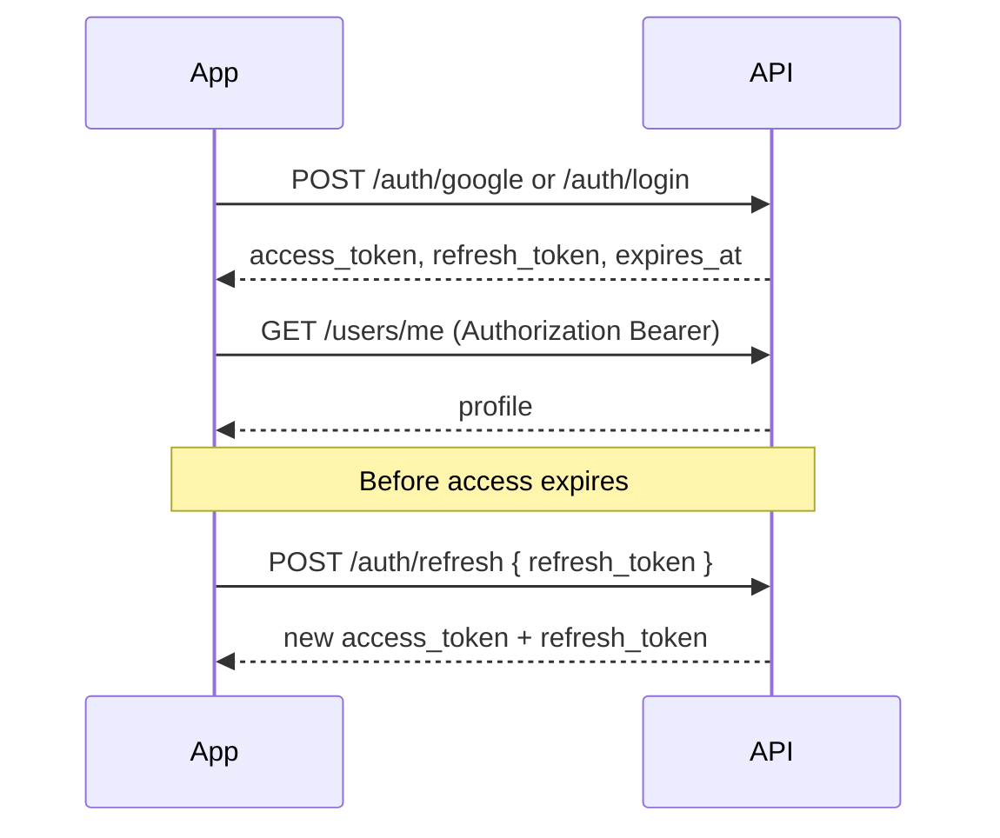

# AI Wardrobe — Mobile App API Guide

Connect your Android/iOS app to the backend. This document describes **how the API works**, **authentication**, and **request/response shapes** with examples.

---

## 1. Base URL

| Environment | Base URL |
|-------------|----------|
| Production | `https://appworkspro.com` |
| Local dev | `http://localhost:3000` |

Example full URL:

```http
GET https://appworkspro.com/api/v1/app/metadata
```

Set the same host in your app config (Retrofit `baseUrl`, Dio `BaseOptions`, etc.).

---

## 2. Response envelope (always)

Every JSON API returns the same wrapper:

**Success (HTTP 2xx):**

```json
{
  "data": { },
  "error": null
}
```

**Failure:**

```json
{
  "data": null,
  "error": {
    "code": "VALIDATION",
    "message": "Human-readable message"
  }
}
```

| HTTP | Typical `error.code` |
|------|---------------------|
| 401 | `UNAUTHORIZED` |
| 403 | `FORBIDDEN` |
| 404 | `NOT_FOUND` |
| 409 | `CONFLICT` |
| 422 | `VALIDATION` |
| 429 | `RATE_LIMIT` |
| 502 | `TRY_ON_FAILED` |
| 503 | `SERVER_CONFIG` |

Always check **`error == null`** before using `data`.

---

## 3. Headers

| Header | When | Example |
|--------|------|---------|
| `Content-Type` | POST/PATCH with JSON | `application/json` |
| `Accept` | All requests | `application/json` |
| `Authorization` | Protected routes | `Bearer eyJhbG…` |
| `X-App-Locale` | Optional content language | `en`, `ur`, `ar` |
| `Accept-Language` | Fallback for locale | `en-US,en;q=0.9` |

Content APIs also return `Content-Language: en` (resolved locale).

---

## 4. Authentication flow



### 4.1 Google Sign-In (recommended on Android)

```http
POST /api/v1/auth/google
Content-Type: application/json
```

```json
{
  "id_token": "<from Google Sign-In SDK>",
  "device_id": "optional-stable-device-id"
}
```

**200 `data`:**

```json
{
  "access_token": "eyJ…",
  "refresh_token": "eyJ…",
  "expires_at": "2026-09-28T12:00:00.000Z",
  "token_type": "Bearer",
  "user": {
    "id": "66f1a2b3c4d5e6f7a8b9c0d1",
    "email": "user@gmail.com",
    "display_name": "Ali",
    "photo_url": "https://lh3.googleusercontent.com/…",
    "role": "user"
  }
}
```

**401** — invalid/expired `id_token` (`INVALID_GOOGLE_TOKEN`).

### 4.2 Email register

```http
POST /api/v1/auth/register
```

```json
{
  "email": "user@example.com",
  "password": "min8chars",
  "display_name": "Ali"
}
```

Same session shape as Google (without `photo_url` if not set).

### 4.3 Email login (app users only)

```http
POST /api/v1/auth/login
```

```json
{ "email": "user@example.com", "password": "…" }
```

Admin accounts must use **`POST /api/v1/auth/admin/login`** (dashboard only).

### 4.4 Refresh access token

```http
POST /api/v1/auth/refresh
```

```json
{ "refresh_token": "<stored refresh token>" }
```

**200 `data`:**

```json
{
  "access_token": "eyJ…",
  "refresh_token": "eyJ…",
  "expires_at": "2026-09-28T13:00:00.000Z",
  "token_type": "Bearer"
}
```

Store the **new** `refresh_token` (rotation). On **401**, force user to sign in again.

### 4.5 Logout

```http
POST /api/v1/auth/logout
Authorization: Bearer <access_token>
```

```json
{ "refresh_token": "<current refresh>" }
```

---

## 5. Images & absolute URLs

Many fields return:

- `image_url` / `thumbnail_url` — path like `/uploads/looks/…/file.png` or full HTTPS URL  
- `*_absolute_url` — full URL built with server `APP_URL` (use in `ImageView` / `Image.network`)

Public file access:

```http
GET https://appworkspro.com/uploads/looks/{userId}/{file}.png
```

(same as `GET /api/v1/files/looks/…`)

---

## 6. App startup (no login required)

Call after install / on splash (optional locale header).

### 6.1 Metadata

```http
GET /api/v1/app/metadata
```

**200 `data` example:**

```json
{
  "app_name": "AI Wardrobe",
  "version": "1.0.0",
  "build_number": "104",
  "support_email": "support@example.com",
  "privacy_url": "https://…",
  "terms_url": "https://…",
  "help_url": "https://…",
  "feature_flags": {
    "try_on_enabled": true
  }
}
```

### 6.2 Languages

```http
GET /api/v1/languages
```

**200 `data`:** `{ "languages": [ { "id", "code", "name", "rtl" }, … ] }`

### 6.3 Onboarding

```http
GET /api/v1/onboarding/pages
```

**200 `data`:**

```json
{
  "pages": [
    {
      "title": "Welcome",
      "body": "…",
      "image_url": "/media/…",
      "sort_order": 0
    }
  ]
}
```

### 6.4 Home feed

```http
GET /api/v1/home/feed?gender=women
```

`gender`: `men` | `women` (optional filter).

**200 `data`:**

```json
{
  "sections": [
    {
      "id": "featured",
      "title": "Featured",
      "type": "style_grid",
      "category_id": "virtual_try_on",
      "items": [
        {
          "style_id": "style-01",
          "category_id": "virtual_try_on",
          "thumbnail_url": "/styles/01.svg",
          "label_key": "…",
          "label": "Summer Look"
        }
      ]
    }
  ]
}
```

### 6.5 Style catalog (try-on)

```http
GET /api/v1/catalog/virtual_try_on?tab=all&gender=women
```

**200 `data`:**

```json
{
  "category_id": "virtual_try_on",
  "title": "Virtual Try-On",
  "gender_scope": "both",
  "gender_tabs": [{ "id": "women", "title": "Women" }],
  "tabs": [{ "id": "all", "title": "All" }],
  "items": [
    {
      "id": "style-01",
      "tab_id": "all",
      "gender_tab_id": "women",
      "image_url": "/styles/01.svg",
      "name": "Green Dress",
      "prompt_command": "…",
      "sort_order": 1
    }
  ]
}
```

Use **`items[].id`** as `style_id` in try-on generate.

### 6.6 Wardrobe categories

```http
GET /api/v1/wardrobe/categories?gender=women
```

**200 `data`:** `{ "categories": [ { "id", "title", "preview_items": […] } ] }`

---

## 7. Push notifications (after login)

```http
POST /api/v1/devices/register
Authorization: Bearer <access_token>
```

```json
{
  "fcm_token": "<Firebase token>",
  "platform": "android",
  "device_id": "stable-id",
  "app_version": "1.0.0"
}
```

**200 `data`:** `{ "device_id", "registered": true }` (shape from server).

---

## 8. Virtual try-on (core flow)

### Step A — Start job

```http
POST /api/v1/try-on/generate
Authorization: Bearer <access_token>
```

```json
{
  "source_image_base64": "data:image/jpeg;base64,/9j/4AAQ…",
  "style_id": "style-01",
  "category_id": "virtual_try_on",
  "style_reference_image_base64": "optional second image",
  "prompt": "optional override",
  "width": 768,
  "height": 1024
}
```

**200 `data`:**

```json
{
  "job_id": "66f1…",
  "external_job_id": "bfl-…",
  "polling_url": "/api/v1/try-on/jobs/66f1…",
  "status": "queued"
}
```

**502** — BFL error (`TRY_ON_FAILED`). **503** — `BFL_API_KEY` missing on server.

### Step B — Poll until done

```http
GET /api/v1/try-on/jobs/{job_id}
Authorization: Bearer <access_token>
```

Poll every **2–3 seconds** until `status` is terminal.

**200 `data`:**

```json
{
  "job_id": "66f1…",
  "status": "completed",
  "result_image_url": "/uploads/looks/…/result.png",
  "result_image_absolute_url": "https://appworkspro.com/uploads/looks/…/result.png",
  "error": null
}
```

| `status` | Meaning |
|----------|---------|
| `queued` | Waiting |
| `processing` | BFL working |
| `completed` | Use `result_image_absolute_url` |
| `failed` | Read `error` |
| `cancelled` | User/admin cancelled |

### Step C — Save to history (optional)

```http
POST /api/v1/history
Authorization: Bearer <access_token>
```

```json
{
  "image_url": "https://appworkspro.com/uploads/looks/…/result.png",
  "source_image_url": "optional original",
  "style_id": "style-01",
  "category_id": "virtual_try_on",
  "is_favorite": false,
  "saved_to_wardrobe": true,
  "try_on_job_id": "66f1…"
}
```

**200 `data`:**

```json
{
  "id": "66f2…",
  "image_url": "/uploads/looks/…",
  "image_absolute_url": "https://appworkspro.com/uploads/…",
  "created_at": "2026-09-28T10:00:00.000Z"
}
```

### History list

```http
GET /api/v1/history?page=1&limit=20&favorites=false
```

**200 `data`:**

```json
{
  "items": [
    {
      "id": "66f2…",
      "image_url": "/uploads/…",
      "image_absolute_url": "https://appworkspro.com/uploads/…",
      "style_id": "style-01",
      "is_favorite": false,
      "saved_to_wardrobe": true,
      "created_at": "2026-09-28T10:00:00.000Z"
    }
  ],
  "meta": { "page": 1, "limit": 20, "total": 5 }
}
```

### Favorite toggle

```http
PATCH /api/v1/history/{id}
```

```json
{ "is_favorite": true, "saved_to_wardrobe": true }
```

---

## 9. User profile

```http
GET /api/v1/users/me
Authorization: Bearer <access_token>
```

**200 `data`:**

```json
{
  "id": "66f1…",
  "email": "user@example.com",
  "display_name": "Ali",
  "photo_url": null,
  "role": "user",
  "status": "active",
  "preferences": {
    "theme_mode": "system",
    "notifications_enabled": true,
    "language_id": "en_US",
    "style_gender_preference": "women"
  }
}
```

```http
PATCH /api/v1/users/me/preferences
```

```json
{
  "notifications_enabled": true,
  "language_id": "en_US",
  "style_gender_preference": "women"
}
```

---

## 10. Recommended app integration order

1. `GET /app/metadata` + `/languages` + `/onboarding/pages`  
2. `POST /auth/google` (or register/login) → save tokens securely  
3. `POST /devices/register` with FCM  
4. `GET /home/feed` + `/catalog/virtual_try_on`  
5. User picks style → `POST /try-on/generate` → poll `GET /try-on/jobs/{id}`  
6. Show result → `POST /history` to save  
7. `GET /history` for gallery; refresh token before expiry  

---

## 11. Kotlin example (Retrofit-style)

```kotlin
// After Google Sign-In
val body = mapOf(
  "id_token" to account.idToken,
  "device_id" to Settings.Secure.getString(ctx.contentResolver, Settings.Secure.ANDROID_ID)
)
val res = api.postGoogle(body)
if (res.error != null) showError(res.error.message)
else {
  tokenStore.save(res.data.access_token, res.data.refresh_token)
}

// Authenticated call
@GET("api/v1/users/me")
suspend fun me(@Header("Authorization") auth: String): ApiEnvelope<UserDto>
// auth = "Bearer ${tokenStore.access}"
```

---

## 12. Admin vs mobile

| Use case | Endpoint |
|----------|----------|
| Mobile app login | `/api/v1/auth/google`, `/auth/login`, `/auth/register` |
| Admin web dashboard | `/api/v1/auth/admin/login` only |

Do not use admin login in the consumer app.

---

*Generated for repo `api.aioutfitchanger.com`. Update `APP_URL` on server when domain changes.*
