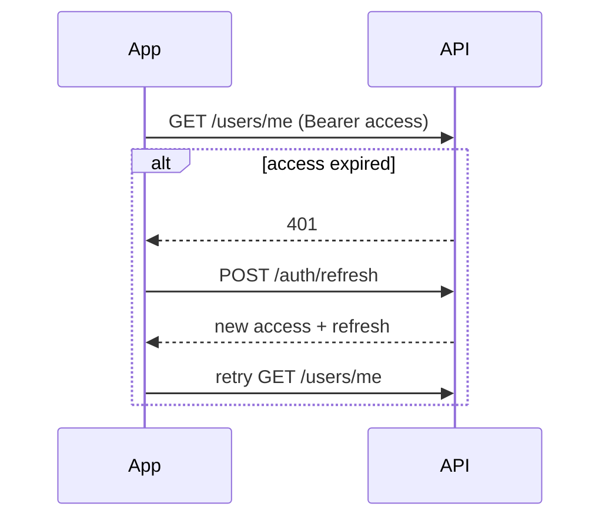

# Token refresh & HTTP interceptor (mobile app)

## Server timing

| Setting | Default | Meaning |
|---------|---------|---------|
| `ACCESS_TOKEN_TTL_SECONDS` | **600** (10 minutes) | Access JWT expires — API returns **401** after that |
| `REFRESH_TOKEN_TTL_SECONDS` | **2592000** (30 days) | Refresh token lifetime |
| `expires_at` in login response | ISO datetime | When **refresh** session ends (not access JWT) |

Access token **expires every ~10 minutes**. Refresh token is long-lived but **rotates** on each `POST /api/v1/auth/refresh` (old refresh becomes invalid).

---

## What the app must store (secure storage)

- `access_token`
- `refresh_token`
- `access_expires_at` — compute client-side: `now + 600s` at login/refresh (or decode JWT `exp` claim)
- `refresh_expires_at` — from `expires_at` in login/refresh response

---

## Strategy (recommended)



**A. Proactive refresh (best UX)**  
Before access expires (e.g. at **9 minutes**), call refresh in background so user never sees 401.

**B. Reactive refresh (interceptor)**  
On **401** from any API (except login/refresh): call refresh once, retry original request once.

**C. Mutex**  
If 5 requests fail at once, only **one** refresh call — others wait on the same lock.

**D. Refresh fails**  
Clear tokens → navigate to login screen.

---

## Endpoints

```http
POST /api/v1/auth/refresh
Content-Type: application/json

{ "refresh_token": "<stored refresh>" }
```

**200:**

```json
{
  "data": {
    "access_token": "...",
    "refresh_token": "...",
    "expires_at": "2026-10-28T...",
    "token_type": "Bearer"
  },
  "error": null
}
```

**401** — `Session expired — sign in again` → full re-login.

Do **not** send `Authorization` on refresh (optional). Always replace **both** tokens after success.

---

## OkHttp interceptor (Kotlin)

```kotlin
class AuthInterceptor(
  private val tokenStore: TokenStore,
  private val refreshApi: RefreshApi, // only POST refresh, no interceptor loop
) : Interceptor {

  private val refreshLock = Mutex()

  override fun intercept(chain: Interceptor.Chain): Response {
    val req = chain.request()
    if (req.url.encodedPath.contains("/auth/refresh") ||
        req.url.encodedPath.contains("/auth/login") ||
        req.url.encodedPath.contains("/auth/google") ||
        req.url.encodedPath.contains("/auth/register")
    ) {
      return chain.proceed(req)
    }

    // Proactive: refresh if access expires in < 60s
    runBlocking {
      if (tokenStore.accessExpiresWithin(60)) {
        refreshLock.withLock { refreshIfNeeded() }
      }
    }

    var response = chain.proceed(req.withBearer(tokenStore.accessToken))
    if (response.code != 401) return response
    response.close()

    runBlocking {
      refreshLock.withLock {
        if (!refreshIfNeeded()) throw IOException("SESSION_EXPIRED")
      }
    }
    return chain.proceed(req.withBearer(tokenStore.accessToken))
  }

  private suspend fun refreshIfNeeded(): Boolean {
    val refresh = tokenStore.refreshToken ?: return false
    val res = refreshApi.refresh(RefreshBody(refresh))
    if (!res.isSuccessful) {
      tokenStore.clear()
      return false
    }
    val body = res.body()!!
    tokenStore.save(
      access = body.data.access_token,
      refresh = body.data.refresh_token,
      refreshExpires = body.data.expires_at,
      accessTtlSeconds = 600,
    )
    return true
  }
}

fun Request.withBearer(token: String?) = newBuilder()
  .apply { if (token != null) header("Authorization", "Bearer $token") }
  .build()
```

## Retrofit refresh API

```kotlin
interface RefreshApi {
  @POST("api/v1/auth/refresh")
  suspend fun refresh(@Body body: RefreshBody): Response<ApiEnvelope<RefreshData>>
}

data class RefreshBody(val refresh_token: String)

data class ApiEnvelope<T>(val data: T?, val error: ApiError?)
data class ApiError(val code: String, val message: String)
```

## Dio (Flutter) — same idea

Use `QueuedInterceptor` + on 401 call refresh, update tokens, `handler.resolve(await fetch(retry))`.

---

## Checklist

- [ ] Parse `{ data, error }` on every response  
- [ ] Save new `refresh_token` after every refresh  
- [ ] Single-flight refresh (mutex)  
- [ ] Proactive refresh ~1 min before access expiry  
- [ ] On refresh 401 → logout  
- [ ] Base URL: `https://appworkspro.com/`
